---
# Preamble

## Author
author:
  name: Верниковская Екатерина Андреевна
  degrees: DSc
  email: 11322361366@pfur.ru
  affiliation:
    - name: Российский университет дружбы народов
      country: Российская Федерация
      postal-code: 117198
      city: Москва
      address: ул. Миклухо-Маклая, д. 6

## Title
title: Отчёт по лабораторной работе №1
subtitle: Моделирование сетей передачи данных
license: CC BY
date: 2026-09-08

## Generic options
lang: ru-RU
crossref:
  lof-title: Список иллюстраций
  lot-title: Список таблиц
  lol-title: Листинги

## Fonts 
mainfont: PT Serif 
romanfont: PT Serif 
sansfont: PT Sans 
monofont: PT Mono 
mainfontoptions: Ligatures=TeX 
romanfontoptions: Ligatures=TeX 
sansfontoptions: Ligatures=TeX,Scale=MatchLowercase 
monofontoptions: Scale=MatchLowercase,Scale=0.9

## Formats
format:
### Pdf output format
  beamer:
    toc: true
    toc-title: Содержание
    number-sections: true
    colorlinks: false
    toc-depth: 2
    slide_level: 2
    aspectratio: 169
    section-titles: true
    theme: metropolis
    themeoptions: progressbar=frametitle,sectionpage=progressbar,numbering=fraction
    pdf-engine: xelatex
    fontenc: T2A
#### Language
    babel-lang: russian
    babel-otherlangs: english

### Html output
  revealjs:
    transition: slide
    margin: 0.2
    smaller: false
    output-ext: html
    theme: beige
    logo: _resources/image/logo_rudn.png
---

# Вводная часть

## Цель работы

Целью данной работы является развёртывание в системе виртуализации (например, в VirtualBox) mininet, знакомство с основными командами для работы с Mininet через командную строку и через графический интерфейс

# Выполнение лабораторной работы

## Настройка образа VirtualBox

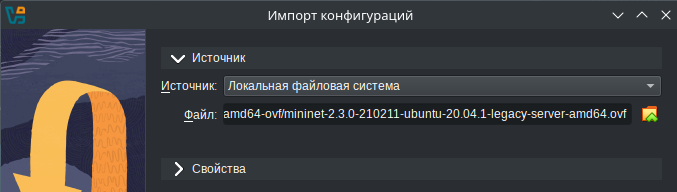{#fig-001 width=70%}

## Настройка образа VirtualBox

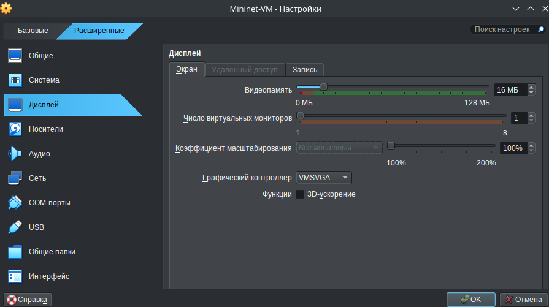{#fig-002 width=70%}

## Настройка образа VirtualBox

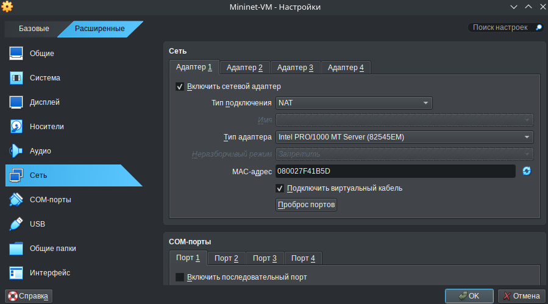{#fig-003 width=70%}

## Настройка образа VirtualBox

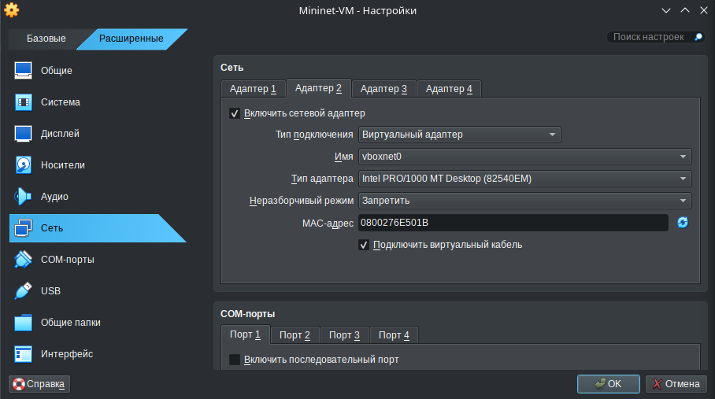{#fig-004 width=70%}

## Подключение к виртуальной машине

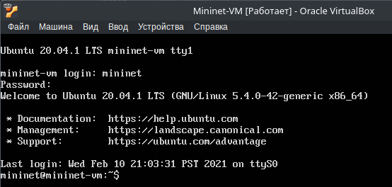{#fig-005 width=70%}

## Подключение к виртуальной машине

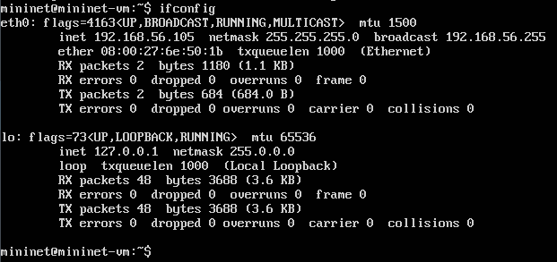{#fig-006 width=70%}

## Подключение к виртуальной машине

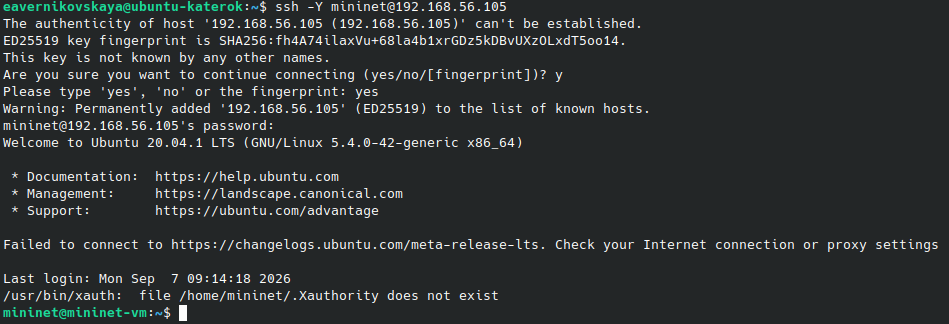{#fig-007 width=70%}

## Подключение к виртуальной машине

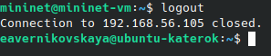{#fig-008 width=70%}

## Подключение к виртуальной машине

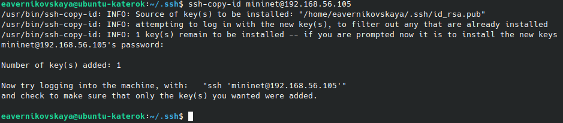{#fig-009 width=70%}

## Подключение к виртуальной машине

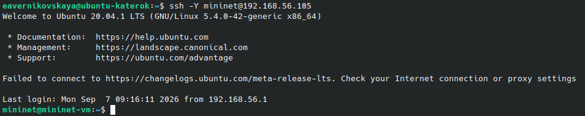{#fig-010 width=70%}

## Настройка доступа к Интернет

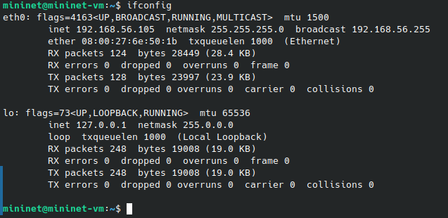{#fig-011 width=70%}

## Настройка доступа к Интернет

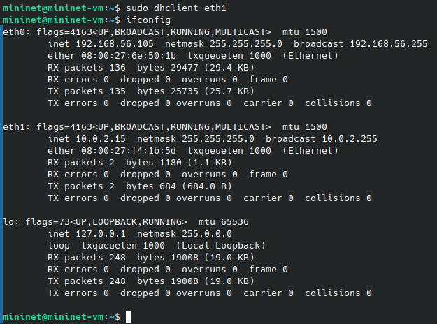{#fig-012 width=65%}

## Настройка доступа к Интернет

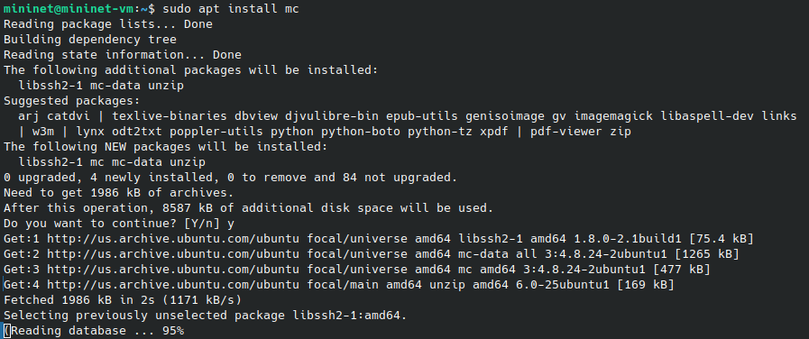{#fig-013 width=70%}
 
## Настройка доступа к Интернет

{#fig-014 width=70%}

## Настройка доступа к Интернет

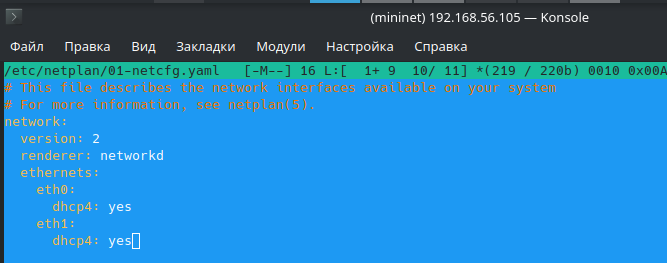{#fig-015 width=70%}

## Обновление версии Mininet

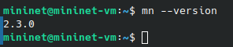{#fig-016 width=70%}

## Обновление версии Mininet

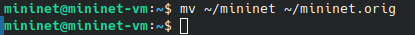{#fig-017 width=70%}

## Обновление версии Mininet

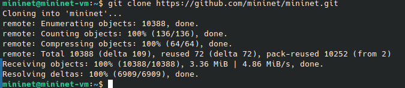{#fig-018 width=70%}

## Обновление версии Mininet

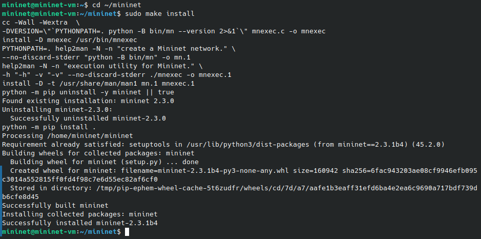{#fig-019 width=70%}

## Обновление версии Mininet

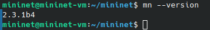{#fig-020 width=70%}

## Настройка параметров XTerm

{#fig-021 width=70%}

## Настройка параметров XTerm

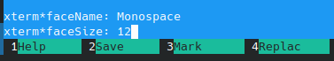{#fig-022 width=70%}

## Настройка соединения X11 для суперпользователя

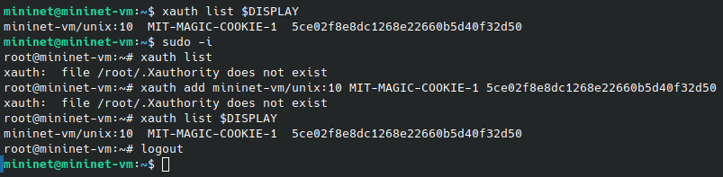{#fig-023 width=70%}

## Работа с Mininet с помощью командной строки

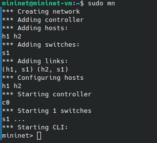{#fig-024 width=50%}

## Работа с Mininet с помощью командной строки

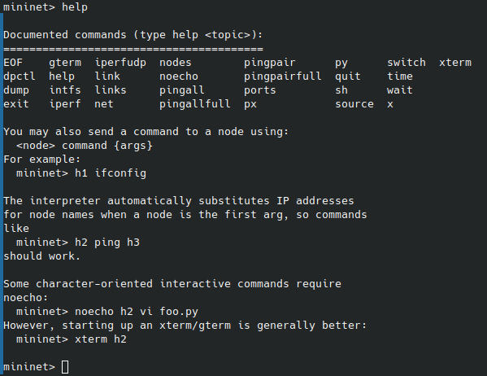{#fig-025 width=65%}

## Работа с Mininet с помощью командной строки

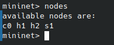{#fig-026 width=70%}

## Работа с Mininet с помощью командной строки

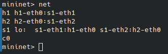{#fig-027 width=70%}

## Работа с Mininet с помощью командной строки

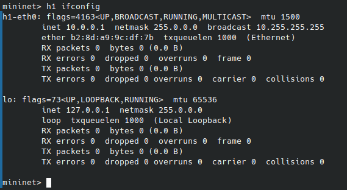{#fig-028 width=70%}

## Работа с Mininet с помощью командной строки

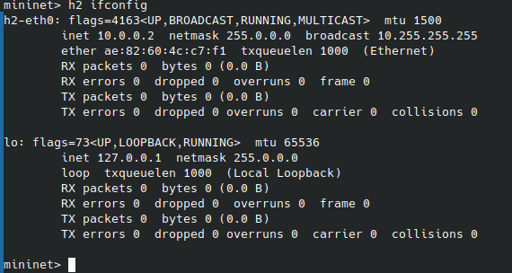{#fig-029 width=70%}

## Работа с Mininet с помощью командной строки

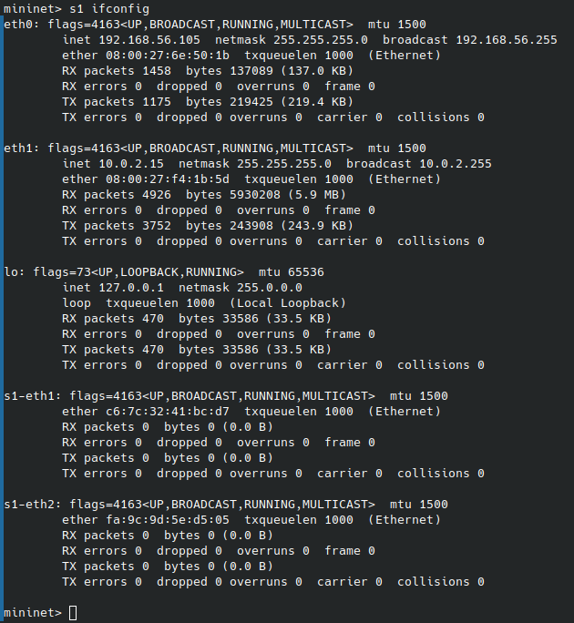{#fig-030 width=50%}

## Работа с Mininet с помощью командной строки

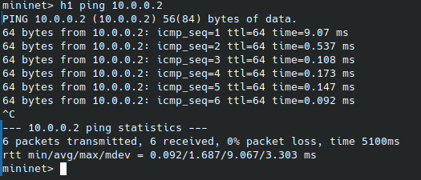{#fig-031 width=70%}

## Работа с Mininet с помощью командной строки

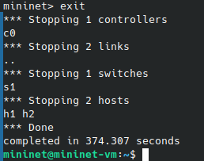{#fig-032 width=60%}

## Построение и эмуляция сети в Mininet с использованием графического интерфейса

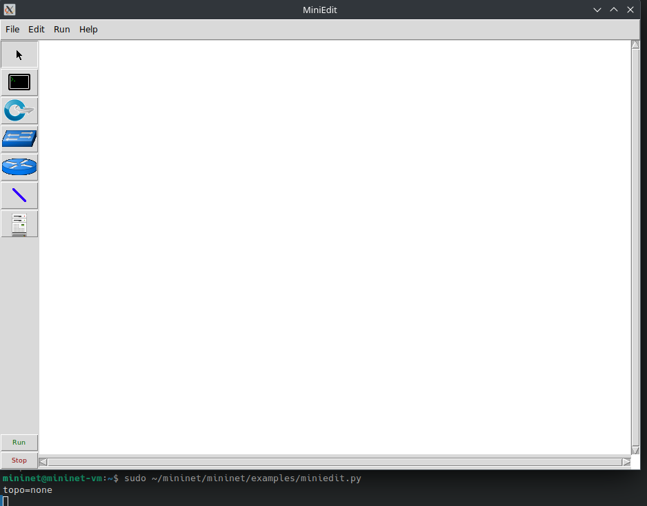{#fig-033 width=55%}

## Построение и эмуляция сети в Mininet с использованием графического интерфейса

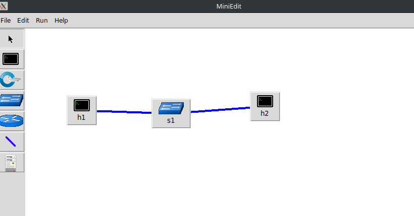{#fig-034 width=70%}

## Построение и эмуляция сети в Mininet с использованием графического интерфейса

{#fig-035 width=50%}

## Построение и эмуляция сети в Mininet с использованием графического интерфейса

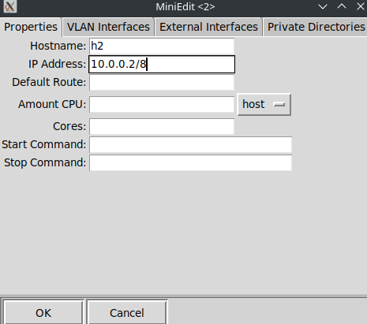{#fig-036 width=50%}

## Построение и эмуляция сети в Mininet с использованием графического интерфейса

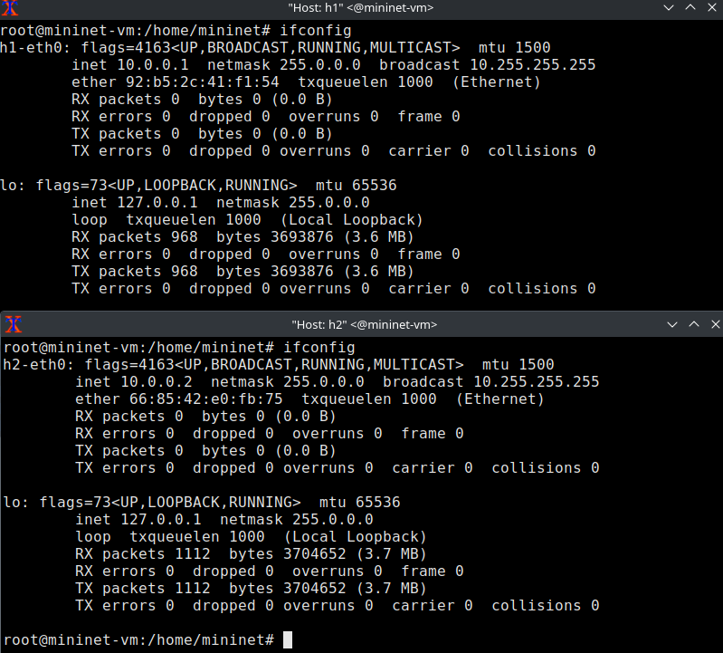{#fig-037 width=50%}

## Построение и эмуляция сети в Mininet с использованием графического интерфейса

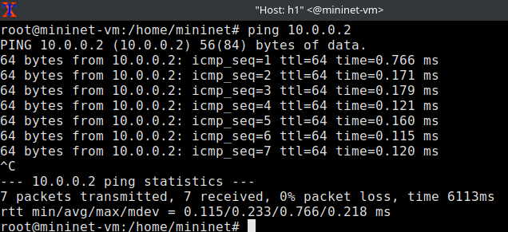{#fig-038 width=70%}

## Построение и эмуляция сети в Mininet с использованием графического интерфейса

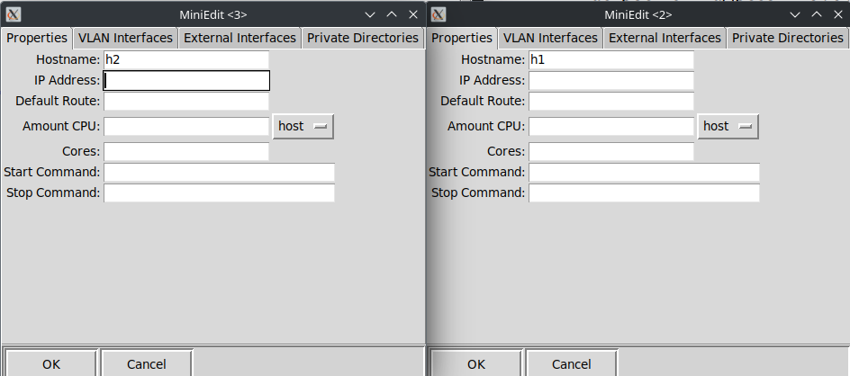{#fig-039 width=70%}

## Построение и эмуляция сети в Mininet с использованием графического интерфейса

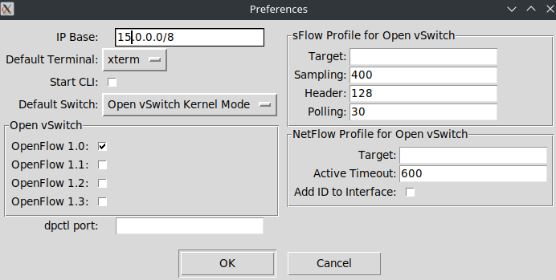{#fig-040 width=70%}

## Построение и эмуляция сети в Mininet с использованием графического интерфейса

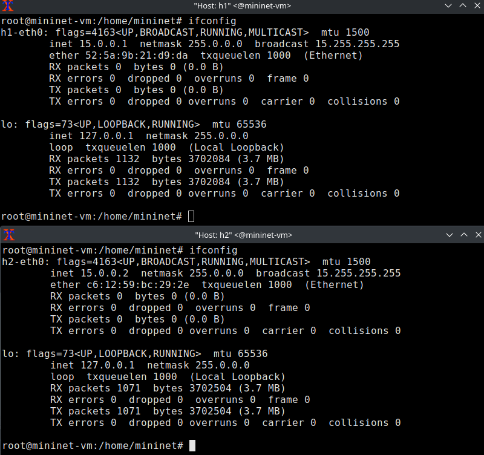{#fig-041 width=45%} 

## Построение и эмуляция сети в Mininet с использованием графического интерфейса

{#fig-042 width=70%} 

## Построение и эмуляция сети в Mininet с использованием графического интерфейса

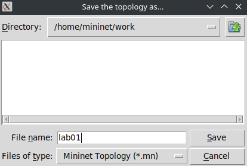{#fig-043 width=65%}

## Построение и эмуляция сети в Mininet с использованием графического интерфейса

{#fig-044 width=70%}

## Построение и эмуляция сети в Mininet с использованием графического интерфейса

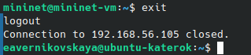{#fig-045 width=70%}

# Подведение итогов

## Выводы

В ходе выполнения лабораторной работы №1 мы развернули в системе виртуализации (VirtualBox) mininet, познакомились с основными командами для работы с Mininet через командную строку и через графический интерфейс

## Список литературы

1. [Лаборатораня работа №1](https://esystem.rudn.ru/pluginfile.php/3318928/mod_folder/content/0/001-mininet-intro.pdf)
2. [Mininet](https://mininet.org/)
3. [Репозиторий Mininet](https://github.com/mininet/mininet)
