---
# Preamble

## Author
author:
  name: Верниковская Екатерина Андреевна
  degrees: DSc
  email: 11322361366@pfur.ru
  affiliation:
    - name: Российский университет дружбы народов
      country: Российская Федерация
      postal-code: 117198
      city: Москва
      address: ул. Миклухо-Маклая, д. 6

## Title
title: Отчёт по лабораторной работе №3
subtitle: Моделирование сетей передачи данных
license: CC BY
date: 2026-10-05

## Generic options
lang: ru-RU
crossref:
  lof-title: Список иллюстраций
  lot-title: Список таблиц
  lol-title: Листинги

## Fonts 
mainfont: PT Serif 
romanfont: PT Serif 
sansfont: PT Sans 
monofont: PT Mono 
mainfontoptions: Ligatures=TeX 
romanfontoptions: Ligatures=TeX 
sansfontoptions: Ligatures=TeX,Scale=MatchLowercase 
monofontoptions: Scale=MatchLowercase,Scale=0.9

## Formats
format:
### Pdf output format
  beamer:
    toc: true
    toc-title: Содержание
    number-sections: true
    colorlinks: false
    toc-depth: 2
    slide_level: 2
    aspectratio: 169
    section-titles: true
    theme: metropolis
    themeoptions: progressbar=frametitle,sectionpage=progressbar,numbering=fraction
    pdf-engine: xelatex
    fontenc: T2A
#### Language
    babel-lang: russian
    babel-otherlangs: english

### Html output
  revealjs:
    transition: slide
    margin: 0.2
    smaller: false
    output-ext: html
    theme: beige
    logo: _resources/image/logo_rudn.png
---

# Вводная часть

## Цель работы

Целью данной работы является знакомство с инструментом для измерения пропускной способности сети в режиме реального времени - iPerf3, а также получение навыков проведения воспроизводимого эксперимента по измерению пропускной способности моделируемой сети в среде Mininet

## Задание

1. Воспроизвести посредством API Mininet эксперименты по измерению пропускной способности с помощью iPerf3
2. Построить графики по проведённому эксперименту

# Выполнение лабораторной работы

## Выполнение лабораторной работы

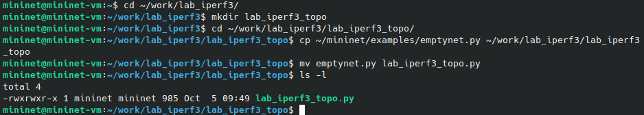{#fig-001 width=70%}

## Выполнение лабораторной работы

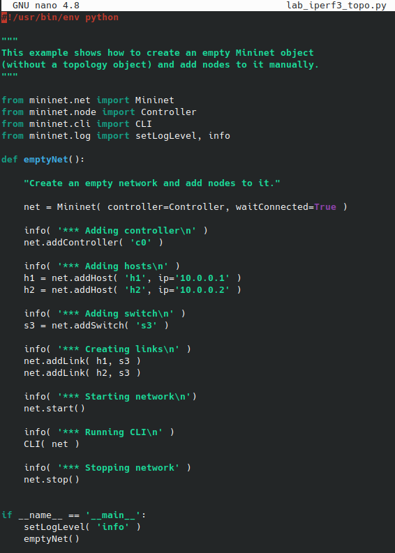{#fig-002 width=35%}

## Выполнение лабораторной работы

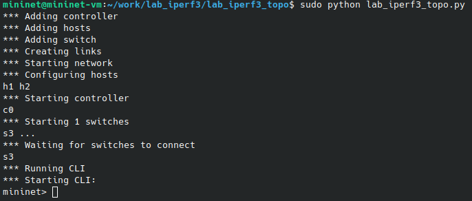{#fig-003 width=70%}

## Выполнение лабораторной работы

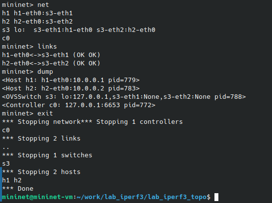{#fig-004 width=65%}

## Выполнение лабораторной работы

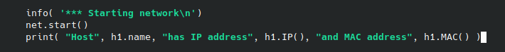{#fig-005 width=70%}

## Выполнение лабораторной работы

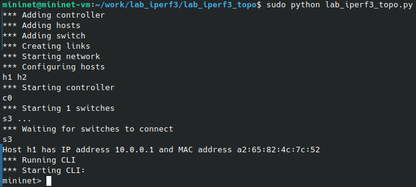{#fig-006 width=70%}

## Выполнение лабораторной работы

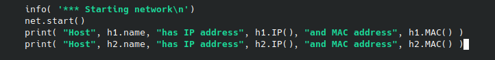{#fig-007 width=70%}

## Выполнение лабораторной работы

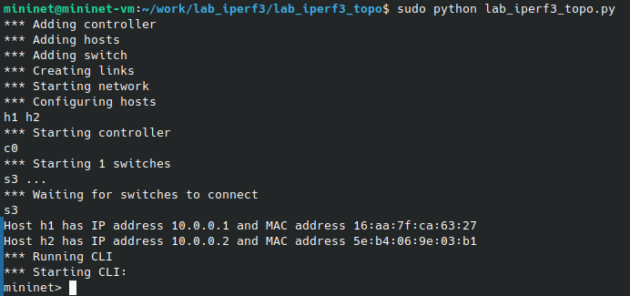{#fig-008 width=70%}

## Выполнение лабораторной работы

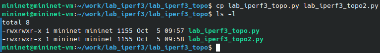{#fig-009 width=70%}

## Выполнение лабораторной работы

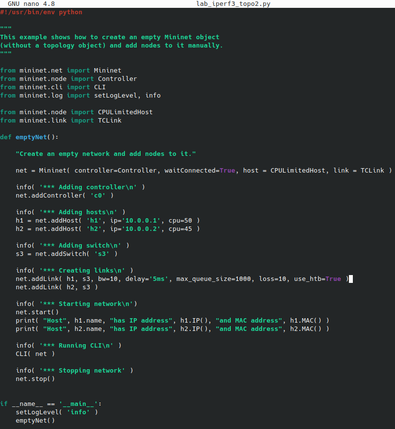{#fig-010 width=45%}

## Выполнение лабораторной работы

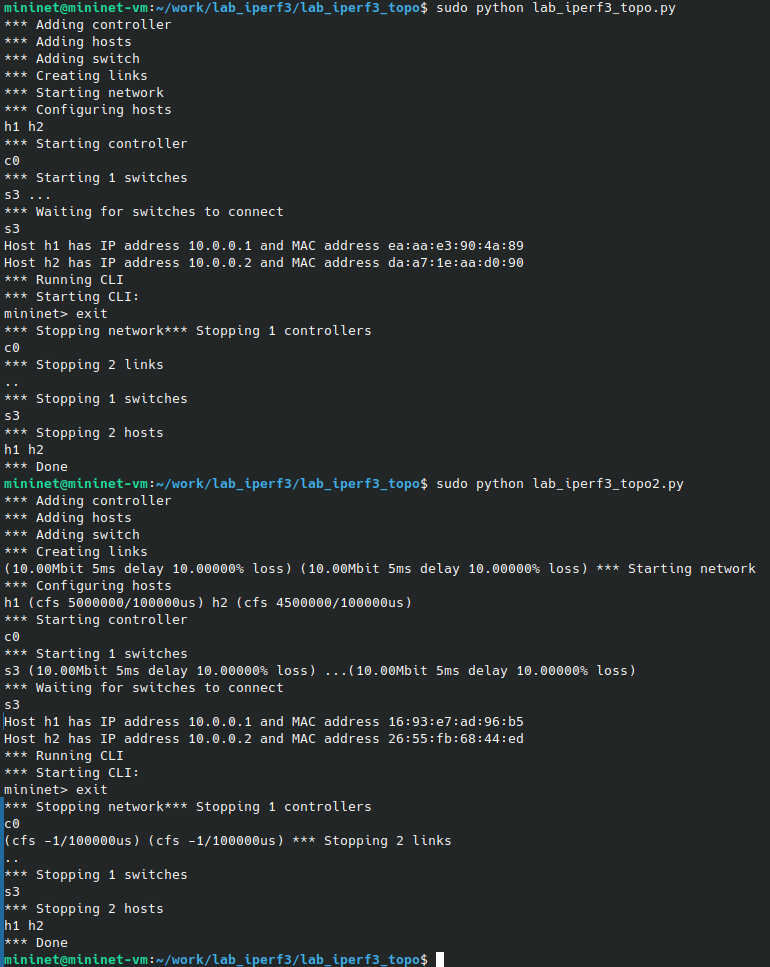{#fig-011 width=40%}

## Выполнение лабораторной работы

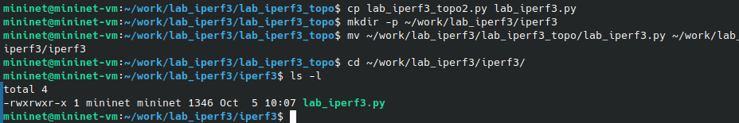{#fig-012 width=70%}

## Выполнение лабораторной работы

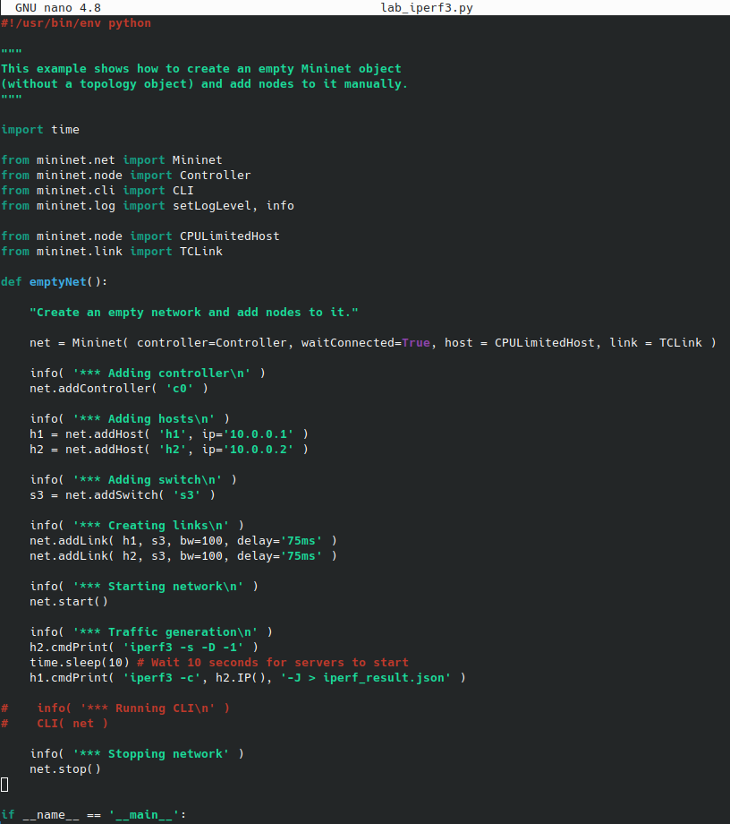{#fig-013 width=40%}

## Выполнение лабораторной работы

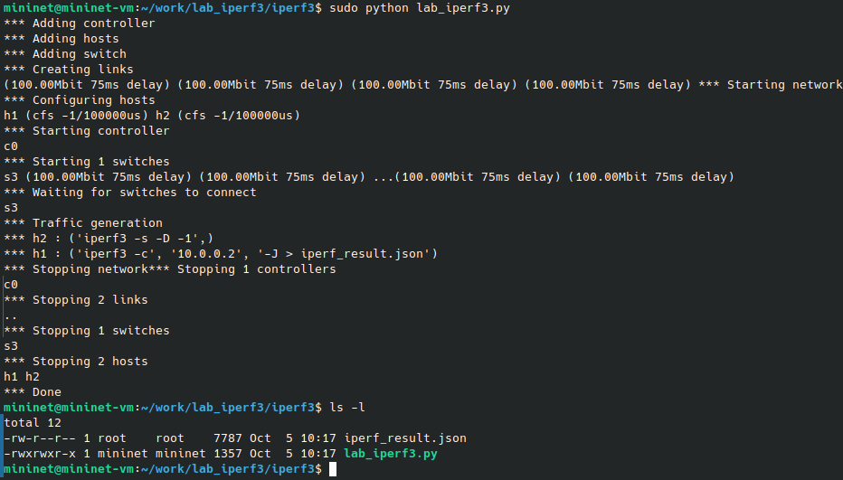{#fig-014 width=70%}

## Выполнение лабораторной работы

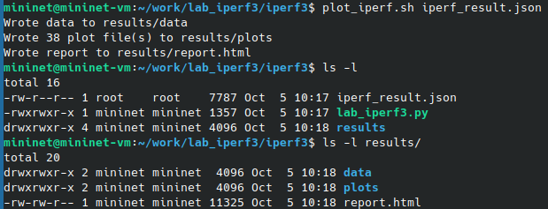{#fig-015 width=70%}

## Выполнение лабораторной работы

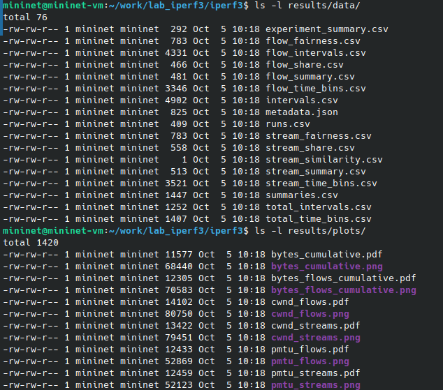{#fig-016 width=55%}

## Выполнение лабораторной работы

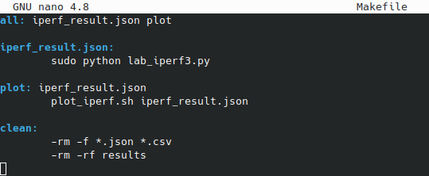{#fig-017 width=70%}

## Выполнение лабораторной работы

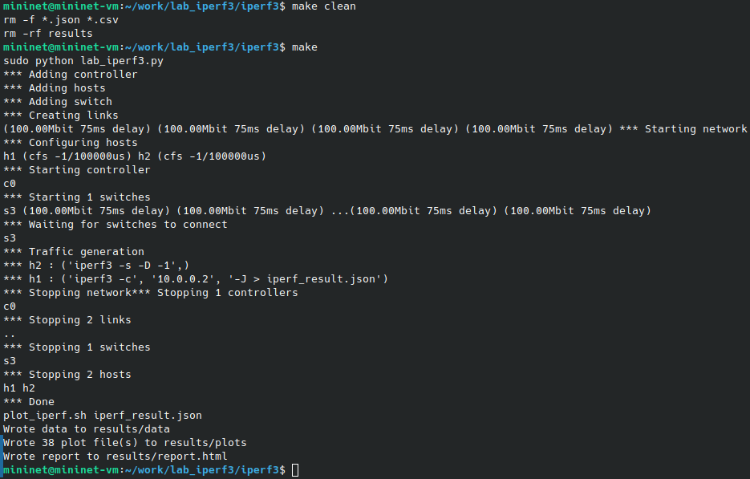{#fig-018 width=70%}

# Подведение итогов

## Выводы

В ходе выполнения лабораторной работы №3 мы познакомились с инструментом для измерения пропускной способности сети в режиме реального времени - iPerf3, а также получили навыки проведения воспроизводимого эксперимента по измерению пропускной способности моделируемой сети в среде Mininet

## Список литературы

1. [Лаборатораня работа №3](https://esystem.rudn.ru/pluginfile.php/3318936/mod_resource/content/1/003-lab_iperf3-2.pdf)
